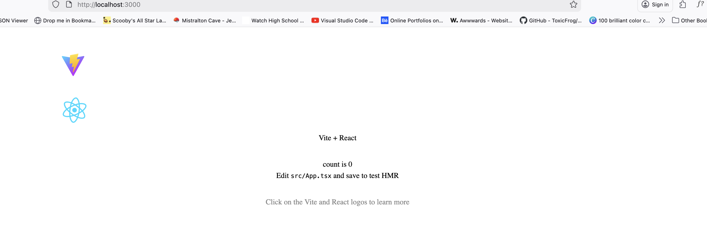

## ✅ Completed Tasks
- [x] Installed Homebrew, .NET 10, Node.js, Yarn
- [x] Created GitHub repository
- [x] Set up .NET solution with 3 projects
- [x] Created React 19 frontend with Vite
- [x] Installed all npm packages using Yarn
- [x] Configured Tailwind CSS and shadcn/ui
- [x] Added configuration files
- [x] Verified both apps run successfully

## 📸 Screenshots
[Add screenshots here]
- Swagger UI running
- React app running on localhost:3000 

## 💻 Code Highlights
```bash
# Backend runs on: https://localhost:7058/swagger
# Frontend runs on: http://localhost:3000
```

## ❓ Challenges Faced
- Challenge 1: [Describe]
- Challenge 2: [Describe]

## 💡 What I Learned Today
1. How to set up a .NET 10 solution with multiple projects
2. React 19 project structure with Vite
3. Using Yarn instead of npm
4. shadcn/ui component installation
5. Project organization best practices

## 🤔 Questions for Review
- Question 1?
- Question 2?

## 📝 Notes
- [Any additional notes]

## ✅ Ready for Day 2: Yes / No

---
**Next Steps (Day 2)**:
- Create folder structure
- Set up MongoDB models
- Create first API endpoint
- Build first React component